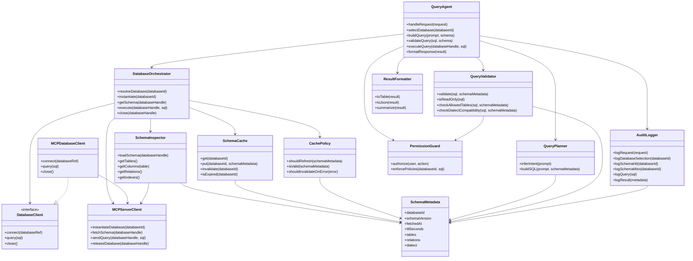

# Agent de consultas a base de datos vía MCP

## Objetivo
Construir un agente que reciba un `database_id` y un prompt, pida al servidor MCP la instanciación temporal de la base, descubra el esquema, genere una consulta segura, la ejecute sobre esa instancia y devuelva el resultado formateado.

## Principios de diseño
- Separación estricta entre orquestación, introspección de esquema, caché y ejecución.
- El agente no debe hablar directo con la base; siempre usa MCP.
- El esquema no se consulta en cada request si existe una caché válida.
- La caché debe invalidarse por TTL, error de esquema o cambio de versión/hash.
- Solo lectura por defecto; escritura solo si se habilita explícitamente.
- Toda operación relevante debe quedar auditada.

## Flujo operativo
1. Llega una petición con `prompt` y `database_id`.
2. `DatabaseOrchestrator` solicita al MCP la instanciación de la base.
3. `SchemaCache` se consulta para decidir si el esquema ya está disponible.
4. Si no hay caché válida, `SchemaInspector` pide el esquema al MCP.
5. `QueryPlanner` construye la SQL usando el prompt y el `SchemaMetadata`.
6. `QueryValidator` valida seguridad, dialecto y alcance.
7. `MCPDatabaseClient` ejecuta la SQL sobre el `databaseHandle`.
8. `ResultFormatter` transforma el resultado para el consumidor.
9. `AuditLogger` registra solicitud, cache hit/miss, esquema usado y query ejecutada.
10. `DatabaseOrchestrator` libera la instancia temporal.

## Contratos principales

### Input del agente
```text
AgentRequest
- requestId: string
- userId: string
- prompt: string
- databaseId: string
- options?:
  - allowWrite?: boolean
  - maxRows?: number
  - preferredDialect?: string
```

### Handle temporal de base
```text
DatabaseHandle
- handleId: string
- databaseId: string
- instanceId: string
- dialect: string
- expiresAt: datetime
```

### Metadatos de esquema
```text
SchemaMetadata
- databaseId: string
- schemaVersion?: string
- fetchedAt: datetime
- ttlSeconds: number
- dialect: string
- tables: TableMetadata[]
- relations: RelationMetadata[]
- indexes?: IndexMetadata[]
```

### Tabla / columna
```text
TableMetadata
- name: string
- columns: ColumnMetadata[]
- primaryKey?: string[]
- isView: boolean

ColumnMetadata
- name: string
- type: string
- nullable: boolean
- isPrimaryKey: boolean
- isForeignKey: boolean
```

## Servicios y responsabilidades

### QueryAgent
Coordina el caso de uso. No contiene lógica de acceso a datos ni de caché.

### DatabaseOrchestrator
Gestiona el ciclo de vida completo: instanciación, obtención de esquema, ejecución y liberación.

### MCPServerClient
Implementa la comunicación remota con el servidor MCP.

### DatabaseClient
Contrato abstracto de acceso a una base instanciada.

### MCPDatabaseClient
Implementación concreta de `DatabaseClient` sobre MCP.

### SchemaInspector
Obtiene estructura de tablas, columnas, relaciones y dialecto desde el MCP.

### SchemaCache
Guarda metadatos de esquema por `databaseId` con TTL e invalidación.

### CachePolicy
Decide si reutilizar, refrescar o invalidar el esquema.

### QueryPlanner
Convierte intención del usuario + esquema en SQL candidata.

### QueryValidator
Rechaza SQL peligrosa, no permitida o incompatible con el esquema/dialecto.

### ResultFormatter
Devuelve el resultado en tabla, JSON o resumen.

### AuditLogger
Registra request, decisión de caché, esquema consultado, SQL ejecutada y resultado.

### PermissionGuard
Aplica políticas por usuario, acción y base.

## Reglas de caché
- La caché se indexa por `databaseId`.
- El esquema debe considerarse expirado cuando supera el TTL.
- Si el MCP expone `schemaVersion` o `schemaHash`, usarlo para invalidación fuerte.
- Si una query falla por columna, tabla o dialecto, refrescar esquema una sola vez y reintentar.
- No guardar resultados de consultas en la caché de esquema.

## Reglas de seguridad
- SQL de solo lectura por defecto.
- Bloquear `DROP`, `DELETE`, `UPDATE`, `INSERT`, `ALTER`, `TRUNCATE` y cualquier DDL/DML no permitida.
- Limitar el número máximo de filas por defecto.
- Validar que la consulta solo toque tablas permitidas.
- Auditoría obligatoria de toda consulta ejecutada.

## Diagrama de clases


## Siguiente paso de implementación
1. Definir los DTOs e interfaces en código.
2. Implementar `MCPServerClient` y `DatabaseOrchestrator`.
3. Añadir `SchemaCache` con TTL.
4. Conectar `QueryPlanner` y `QueryValidator`.
5. Crear pruebas para cache hit, cache miss e invalidación por error.
